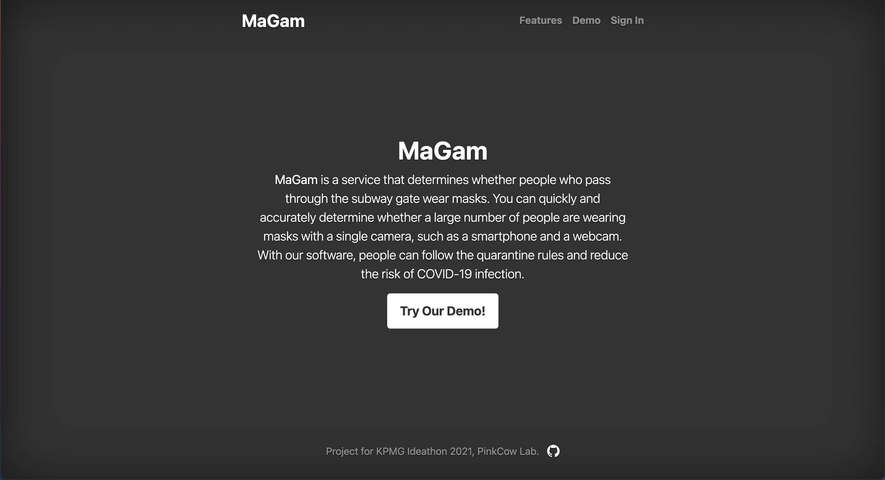

## MaGam: Mask Recognition Project

Project for KPMG Ideathon 2021  
PinkCow Lab.

MaGam is a service that determines if people who pass through the subway gate wear masks. You can quickly and accurately determine whether a large number of people are wearing masks with any camera, including smartphones and webcams. With our software, we can reduce the risk of COVID-19 infection and efficiently allocate resources.

## Our Mission

Main Mission: Checking if people are wearing mask in correct ways by detecting nose through AI, thereby preventing the spread of COVID-19
Sub Mission 1: Correctly detecting people who are wearing masks in wrong ways
Sub Mission 2: Providing more efficient way of detecting mask quickly in larger scales
Sub Mission 3: Reduction of socioeconomic cost related to pandemic situation

### How to Try Our Web app

1. With your prefferd browser(We recommend Chrome), enter https://mymagam.com
   
1. Enter the demo section of our homepage
   
1. Allow 'mymagam.com' to use your camera
   
1. Select camera to use for mask detection
1. Enter your username to use in our service
   
1. You will see the sight of the camera you choose
   
1. You can drag and select the section in which you want mask detection by pressing the brush icon
   
1. You can erase the selected detection area with the eraser icon

1. You can name the selected detection area in the white naming section, and each area is classified with a color code

1. If Magam starts detecting mask, you can check it in the buttons
   
1. If Magam senses someone who is not properly wearing a mask in designated sections, it will give you a notification message.
   
1. Enjoy!

### How to get data from api

1. GET https://mymagam.com/api/[your user name]
1. You can get the current status of mask recognition
   
1. Use api to control IOT enabled Devices
   
   
1. enjoy

### How to Setup in Local

1. Install Python 3 from https://www.python.org/
1. Install OpenCV from https://opencv.org/
1. Install Node.js from https://nodejs.org/en/
1. Copy your Python 3 install path. In terminal, following command is available.
   ```
   python
   >>> import sys
   >>> sys.executable
   ```
1. Paste it into /server/python-node.js
   ```
   let options = {
   pythonPath: "( /* Paste It into Here */ )",
   scriptPath: "../core",
   };
   ```
1. Change your current directory into /server, start server.
   ```
   cd server
   node server
   ```
1. With your prefferd browser(We recommend Chrome), enter http://localhost:3000
1. Enjoy!

## Our Technological Advantages

1. Mask detection with nose: By detecting masks with nose data, Magam is not limited to certain devices or places in its usage. You can use Magam with any cameras including smartphones and Raspberry Pi. Also, utilizing abundant nose data used for face recognition, Magam builds high level of occuracy - when using mask recognition AI might show errors when detecting many people with one camera. Furthermore, Magam catches those who does not wear mask in a proper way such as just covering their mouth and chin. Magam would also work when mask designs get different form each other, regardless of their shape and size.
2. Solution using SaaS: SaaS enables Magam to be easily accessible to anyone, anywhere as long as internet is there. This makes operating and using the system easier for administrators and users. This leads to easier collection and control of data, which makes systematic errors be easily fixable remotely. The data collected by Magam can be used statistically, or for more effective resource attribution. This platform based on web can further be made into apps or packages.

## Business

1. Business Field: Starting from public transportation such as subway, bus, and train - SOM - Magam will expand its implementation to public facilities such as city/regional offices and schools - SAM. Magam eventually aims to be applicable to global market in general - TAM -, with private businesses such as department stores and independent enterprises utilizing Magam to prevent the spread of COVID-19.
1. Business Model: Users of Magam will pay for the service on hour base. They will buy user credits in packages such as 10 hours, 100 hours, or 1-month-unlimited, and use it on their business. In Magam's early market stage, free usage will be given to further attract possible Magam customers.

## Values

1. Socio-Economic Values: Magam can process mask detection much faster than human can: considering South Korea's minimum wage standard of ￦ 8720 per hour, Magam can carry out 87 times of human work at the same price if we set Magam's price per hour as ￦ 100. Magam would also decrease social and economic cost that was happening due to human constraints, and would enable human workers to concentrate on their original tasks rather than focusing on mask detection.
2. Scalability: Magam can be applied anywhere as long as internet and camera are provided.
3. Spontaneity: Magam can be applied in real life as fast as you want - it can be applied right now.
4. Safety: Magam reduces the danger of COVID-19 pandemic, and minimizes unnecessary face-to-face human contact in mask checking processes.

## Post-COVID

1. Magam's feature recognizing algorithm can be applied to various fields such as:

- Detection of safety helmet in construction sites
- Detection of gas masks in chemical related fields
